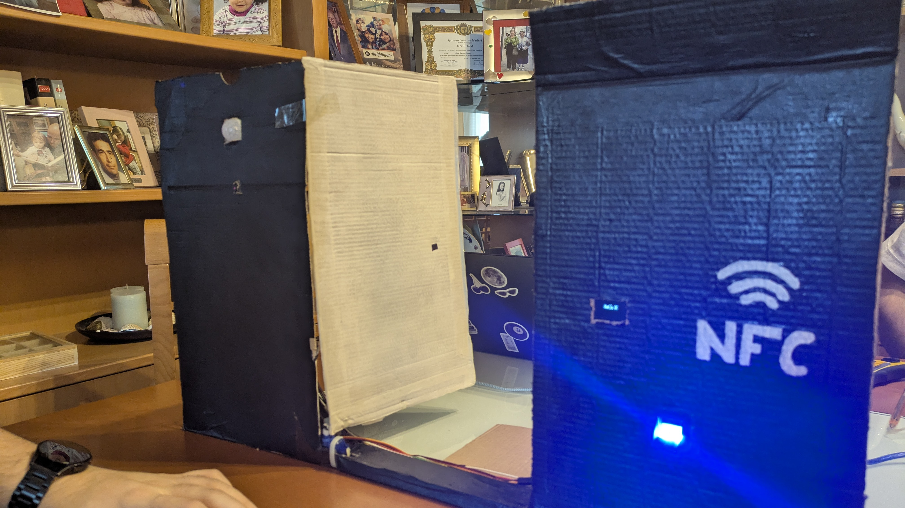
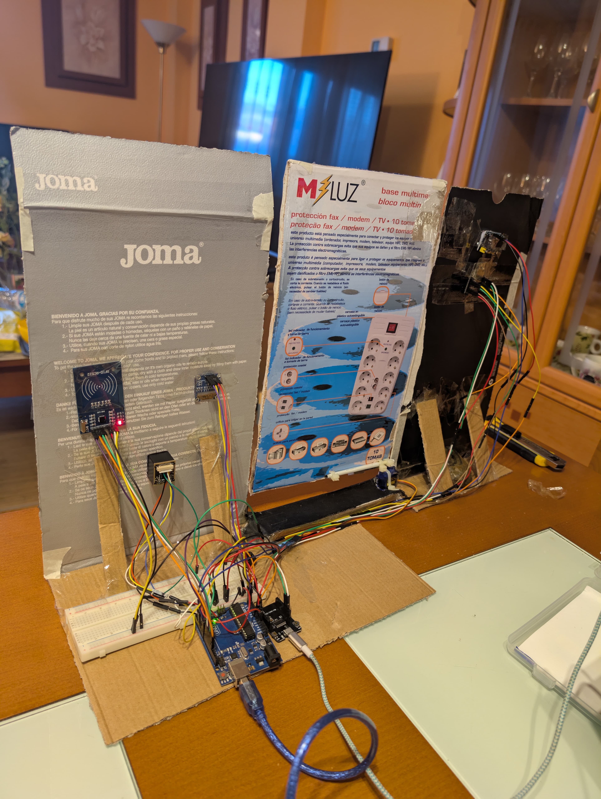
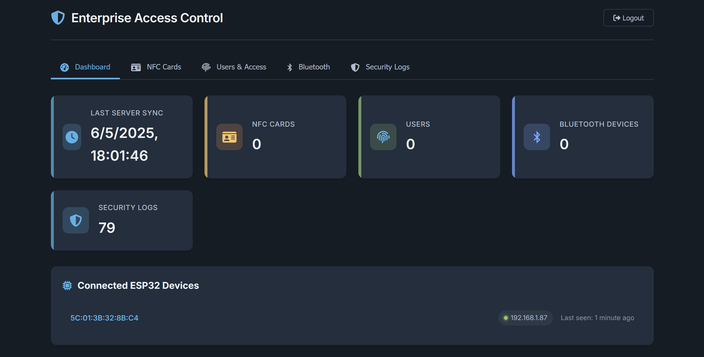
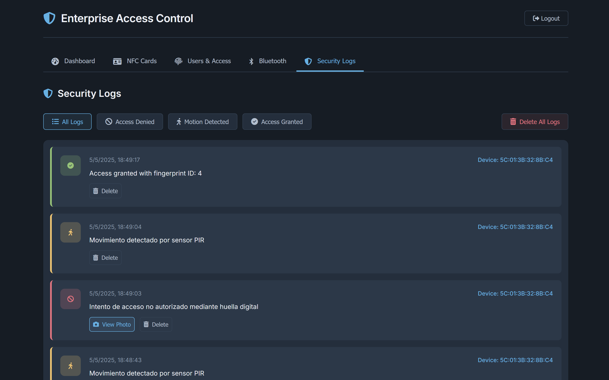

# ESP32 Access Control System

A complete access control solution using ESP32 and Arduino platforms to manage secure entry via multiple authentication methods.

<table>
  <tr>
    <td></td>
    <td></td>
  </tr>
</table>

## Features

- **Multi-factor Authentication**:
  - NFC card scanning
  - Fingerprint recognition
  - Bluetooth proximity detection

- **Security Monitoring**:
  - Photo capture on access attempts
  - Comprehensive logging system
  - Real-time notifications

- **Web Interface**:
  - User-friendly dashboard
  - Credential management
  - Access logs and reporting

## System Architecture

The system consists of three main components:

1. **ESP32-CAM**: Core controller that handles:
   - Camera functionality for security photos
   - WiFi connectivity
   - API communication with backend

2. **Arduino Controller**: Manages physical peripherals including:
   - NFC card reading and verification
   - Bluetooth device detection
   - Fingerprint registration and verification
   - Door lock control

3. **Backend Server**: Provides administration and data persistence:
   - Web interface for system management
   - Database for users and access logs
   - API endpoints for device communication

## Hardware Requirements

- ESP32-CAM module
- Arduino (Uno/Nano/Mega)
- RFID-RC522 NFC reader
- R503 Fingerprint sensor
- Door lock relay mechanism
- Status LEDs
- Power supply

## Hardware Setup

### Component Connections




### Wiring Diagram

```
Arduino     NFC Reader (MFRC522)
----------------------------
3.3V    <-> 3.3V
GND     <-> GND
D10     <-> SDA/SS
D13     <-> SCK
D12     <-> MISO
D11     <-> MOSI
D9      <-> RST

Arduino     Fingerprint Sensor
----------------------------
5V      <-> VCC
GND     <-> GND
D2 (RX) <-> TX
D3 (TX) <-> RX

ESP32     Door Control
-----------------------
GPIO26 <-> Relay for lock
GPIO27 <-> Door status sensor
GPIO13 <-> Access LED (green)
GPIO12 <-> Deny LED (red)
```

## Quick Start Guide

### Server Setup

1. Clone the repository
   ```bash
   git clone 'https://github.com/Eclipse3k/esp32-access-control.git'
   cd esp32-access-control
   ```

2. Install and start the server
   ```bash
   ./setup.sh
   ./start.sh
   ```

3. Access the web interface at http://localhost:3000

4. Login with the default credentials
   ```
   Username: admin
   Password: esp32admin
   ```

### Hardware Setup

1. Connect components according to the wiring diagram above

2. Configure the ESP32 with your network settings:
   ```cpp
   // WiFi Credentials
   const char* ssid = "YOUR_WIFI_SSID";
   const char* password = "YOUR_WIFI_PASSWORD";
   
   // Server details
   const char* apiBaseUrl = "http://YOUR_SERVER_IP:3000";
   ```

3. Upload the Arduino code:
   - Upload `arduino/main.ino` to your Arduino board
   - Upload `esp32/main.ino` to your ESP32-CAM

4. Power up the system and verify connectivity

### Required Libraries

- SPI
- MFRC522 (for NFC reading)
- ArduinoJson
- WiFi
- Adafruit Fingerprint Sensor
- SSD1306 (for OLED display)
- ESP32Servo

## Usage

### Registering NFC Cards

1. Present a new card to the reader
2. The system will capture the UID
3. Approve via web interface
4. Assign a user name and access permissions

### Registering Fingerprints

1. Present an authorized NFC card
2. Follow the OLED display instructions to scan fingerprint twice
3. The system will confirm successful registration

### Accessing the Secured Area

Present either:
- An authorized NFC card
- A registered fingerprint
- Have an authorized Bluetooth device in range

The system will authenticate, log the access attempt with photo, and unlock the door if authorized.

## Project Structure

```
├── arduino/               # Arduino controller code
│   ├── main.ino           # Main Arduino sketch
│   └── clear-fingerprints.ino # Utility for sensor maintenance
├── esp32/                 # ESP32-CAM code
│   └── main.ino           # Main ESP32 sketch
├── backend/               # Node.js server
│   ├── server.js          # API implementation
│   └── data/              # Data persistence
└── frontend/              # Web interface
    ├── index.html         # Dashboard
    ├── login.html         # Authentication
    └── script.js          # Frontend logic
```

## Troubleshooting

- **ESP32 Not Connecting**: Check WiFi credentials
- **NFC Reader Not Working**: Verify wiring connections to the RC522 module
- **Server Not Responding**: Make sure the server is running and the ESP32 is using the correct IP address
- **Access Problems**: Check the serial output for debugging information

## License

This project is licensed under the MIT License - see the LICENSE file for details.

## Acknowledgments

This project was developed by: 
- [Joaquin](https://github.com/Jjoaquin04)
- [Jorge](https://github.com/Eclipse3k)
- [Sergio](https://github.com/CodeInIA)


## Screenshots

<table>
  <tr>
    <td></td>
    <td></td>
  </tr>
  <tr>
    <td></td>
    <td></td>
  </tr>
</table>

<!-- 
When you have photos ready:
1. Add them to the 'images' folder with the filenames above
2. Or rename the image references here to match your actual filenames
-->
